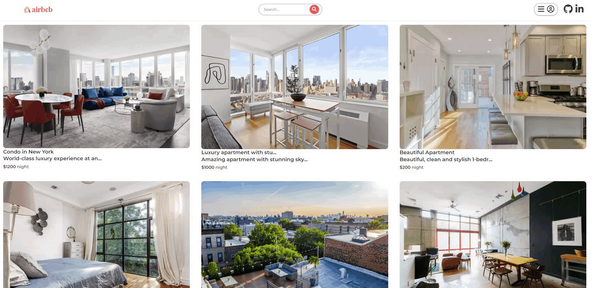
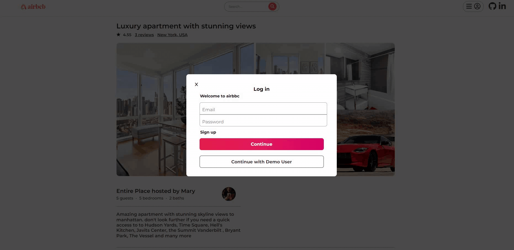
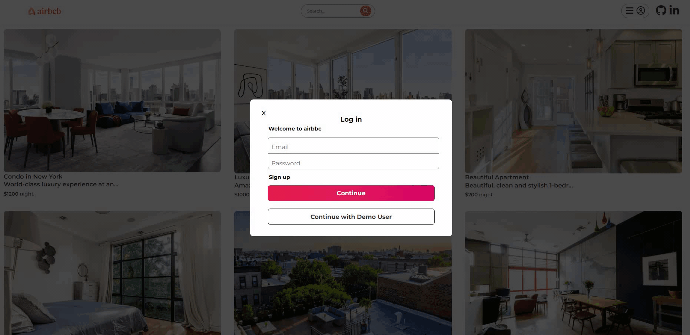

# WELCOME TO AIRBCB!

[Live Site](https://airbbc.onrender.com)

### Introduction
Airbcb is a clone of Airbnb and inspired by the movie The Holdiay. Airbnb is a service that provides a platform for users for lease their apartments for short-term. The idea behind Airbcb (air bed, car & breakfast) is to provide both an apartment as well as a car to another user for short-term use.

The technologies that were used during the production of Airbcb
* Languages: Javascript, Ruby on Rails, HTML, CSS
* Frontend: React-Redux
* Database: PostgreSQL
* Hosting: Render
* Asset Storage: AWS Simple Cloud Storage (S3)

# MVPs

## Profiles
A user is able to create a profile that persist to both front and backend. A user can also log in as a demo user.

There are login and signup error handling:

## Reviews
A user who is not the owner of the apartment can create and delete review. Number of reviews and visual component of an apartment is being updated dynamically:

## Search
There is a dynamic search that searches for a specified word in a title:

### Thank you

__airbcb__ was created in 2 weeks. I hope you will enjoy using it. Please feel free to contact me. My contact information can be found on the site using the live link above.

